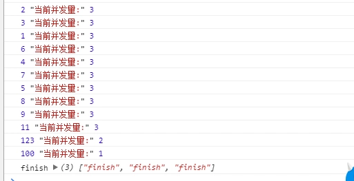
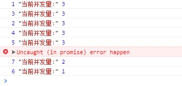

# 前言

做过爬虫的都知道，要控制爬虫的请求并发量，其实也就是控制其爬取频率，以免被封IP，还有的就是以此来控制爬虫应用运行内存，否则一下子处理N个请求，内存分分钟会爆。

而 python爬虫一般用多线程来控制并发，

然而如果是node.js爬虫，由于其单线程无阻塞性质以及事件循环机制，一般不用多线程来控制并发（当然node.js也可以实现多线程，此处非重点不再多讲），而是更加简便地直接在代码层级上实现并发。

为图方便，开发者在开发node爬虫一般会找一个并发控制的npm包，然而第三方的模块有时候也并不能完全满足我们的特殊需求，这时候我们可能就需要一个自己定制版的并发控制函数。

下面我们用15行代码实现一个并发控制的函数。

# 具体实现

## 参数

首先，一个基本的并发控制函数，基本要有以下3个参数：

+ list {Array} - 要迭代的数组
+ limit {number} - 控制的并发数量
+ asyncHandle {function} - 对list的每一个项的处理函数

## 设计

以下以爬虫为实例进行讲解

设计思路其实很简单，假如并发量控制是 5

1. 首先，瞬发 5 个异步请求，我们就得到了并发的 5 个异步请求

```js
// limit = 5
while(limit--) {
    handleFunction(list)
}
```

2. 然后，这 5 个异步请求中无论哪一个先执行完，都会继续执行下一个list项

```js
let recursion = (arr) => {
    return asyncHandle(arr.shift())
        .then(()=>{
            // 迭代数组长度不为0， 递归执行自身
            if (arr.length!==0) return recursion(arr) 
            // 迭代数组长度为0，结束 
            else return 'finish';
        })
}
```

3. 等list所有的项迭代完之后的回调

```js
return Promise.all(allHandle)
```

## 代码

上述步骤组合起来，就是
```js
/**
 * @params list {Array} - 要迭代的数组
 * @params limit {Number} - 并发数量控制数
 * @params asyncHandle {Function} - 对`list`的每一个项的处理函数，参数为当前处理项，必须 return 一个Promise来确定是否继续进行迭代
 * @return {Promise} - 返回一个 Promise 值来确认所有数据是否迭代完成
 */
let mapLimit = (list, limit, asyncHandle) => {
  let recursion = (arr) => {
    return asyncHandle(arr.shift())
        .then(()=>{
          if (arr.length!==0) return recursion(arr)   // 数组还未迭代完，递归继续进行迭代
          else return 'finish';
        })
  };
  
  let listCopy = [].concat(list);
  let asyncList = []; // 正在进行的所有并发异步操作
  while(limit--) {
      asyncList.push( recursion(listCopy) ); 
  }
  return Promise.all(asyncList);  // 所有并发异步操作都完成后，本次并发控制迭代完成
}
```

## 测试demo

模拟一下异步的并发情况

```js
var dataLists = [1,2,3,4,5,6,7,8,9,11,100,123];
var count = 0;
mapLimit(dataLists, 3, (curItem)=>{
  return new Promise(resolve => {
    count++
    setTimeout(()=>{
      console.log(curItem, '当前并发量:', count--)
      resolve();
    }, Math.random() * 5000)  
  });
}).then(response => {
  console.log('finish', response)
})
```

结果如下：



手动抛出异常中断并发函数测试：
```js
var dataLists = [1,2,3,4,5,6,7,8,9,11,100,123];
var count = 0;
mapLimit(dataLists, 3, (curItem)=>{
  return new Promise((resolve, reject) => {
    count++
    setTimeout(()=>{
    console.log(curItem, '当前并发量:', count--)
    if(curItem > 4) reject('error happen')
      resolve();
    }, Math.random() * 5000)  
  });
}).then(response => {
  console.log('finish', response)
})
```

并发控制情况下，迭代到5,6,7 手动抛出异常，停止后续迭代：

