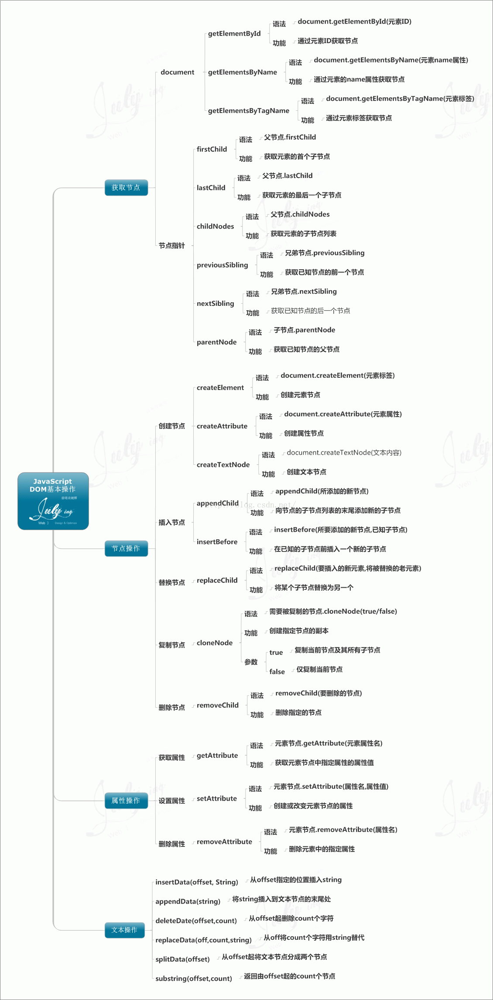
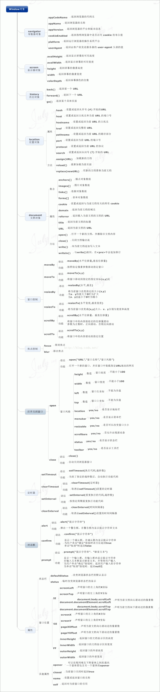

## BOM & DOM

> DOM 描述了处理网页内容的方法和接口，BOM 描述了与浏览器进行交互的方法和接口。

[参考](https://segmentfault.com/a/1190000000654274)

**BOM**

- DOM
  - window
    - document、
    - location、
    - navigator、
    - screen、
    - history、
    - frames
  - Document
    - forms、
    - location、
    - anchors、
    - images、
    - links
    - 
    - getElementsByTagName
    - getElementsByName
    - getAttribute
    - setAttribute
    - removeAttribute

| 方法                   | 说明                     |
| ---------------------- | ------------------------ |
| getElementById()       | 获取特定ID元素的节点     |
| getElementsByTagName() | 获取相同元素的节点列表   |
| getElementsByName      | 获取相同名称的节点列表   |
| getAttribute()         | 获取特定元素节点属性的值 |
| setAttribute()         | 设置特定元素节点属性的值 |
| removeAttribute()      | 移除特定元素节点属性     |


**元素节点属性**
| 节点属性  | 说明                                     |
| --------- | ---------------------------------------- |
| nodeName  | 返回一个字符串，其内容是节点的名字       |
| nodeType  | 返回一个整数，这个数值代表给定节点的类型 |
| nodeValue | 返回给定节点的当前值                     |

**遍历节点树**

| 属性            | 说明                                         |
| --------------- | -------------------------------------------- |
| childNodes      | 返回一个数组，这个数组由给定元素的子节点构成 |
| firstChild      | 返回第一个子节点                             |
| lastChild       | 返回最后一个子节点                           |
| parentNode      | 返回一个给定节点的父节点                     |
| nextSibling     | 返回给定节点的下一个子节点                   |
| previousSibling | 返回给定节点的上一个子节点                   |

**DOM操作**

| 属性                  | 说明                                                   |
| --------------------- | ------------------------------------------------------ |
| creatElement(element) | 创建一个新的元素节点                                   |
| creatTextNode()       | 创建一个包含给定文本的新文本节点                       |
| appendChild()         | 指定节点的最后一个节点列表后添加一个新的子节           |
| insertBefore()        | 将一个给定节点插入到一个给定元素节点的给定子节点的前面 |
| removeChild()         | 从一个给定元素中删除子节点                             |
| replaceChild()        | 把一个给定父元素里的一个子节点替换为另外一个节点       |

**如何阻止冒泡？**

```js
e.cancelBubble=true;
e.stopPropagation();
return false;
```


**location对象**

```js
location对象：表示载入窗口的URL，也可用window.location引用它  

location.href  //当前载入页面的完整URL，如http://www.somewhere.com/pictures/index.htm  

location.portocol  //URL中使用的协议，即双斜杠之前的部分，如http 

location.host  //服务器的名字，如www.wrox.com  

location.hostname  //通常等于host，有时会省略前面的www  

location.port  //URL声明的请求的端口，默认情况下，大多数URL没有端口信息，如8080 

location.pathname  //URL中主机名后的部分，如/pictures/index.htm  

location.search  //执行GET请求的URL中的问号后的部分，又称查询字符串，如?param=xxxx  

location.hash  //如果URL包含#，返回该符号之后的内容，如#anchor1  

location.assign("http:www.baidu.com");  //同location.href，新地址都会被加到浏览器的历史栈中  

location.replace("http:www.baidu.com");  //同assign()，但新地址不会被加到浏览器的历史栈中，不能通过back和forward访问  

location.reload(true | false);  //重新载入当前页面，为false时从浏览器缓存中重载，为true时从服务器端重载，默认为false  
```

**navigator对象**

`navigator`对象：包含大量有关Web浏览器的信息，在检测浏览器及操作系统上非常有用，也可用window.navigator引用它  

```js


`navigator.appCodeName`  //浏览器代码名的字符串表示  

navigator.appName  //官方浏览器名的字符串表示  

navigator.appVersion  //浏览器版本信息的字符串表示  

navigator.cookieEnabled  //如果启用cookie返回true，否则返回false  

navigator.javaEnabled  //如果启用java返回true，否则返回false  

navigator.platform  //浏览器所在计算机平台的字符串表示  

navigator.plugins  //安装在浏览器中的插件数组  

navigator.taintEnabled  //如果启用了数据污点返回true，否则返回false  

navigator.userAgent  //用户代理头的字符串表示   
```


**screen对象**

```js
  screen对象：用于获取某些关于用户屏幕的信息，也可用window.screen引用它  
  screen.width/height  //屏幕的宽度与高度，以像素计  
  screen.availWidth/availHeight  //窗口可以使用的屏幕的宽度和高度，以像素计 
  screen.colorDepth  //用户表示颜色的位数，大多数系统采用32位  
  window.moveTo(0, 0);  
  window.resizeTo(screen.availWidth, screen.availHeight);  //填充用户的屏幕   
```


