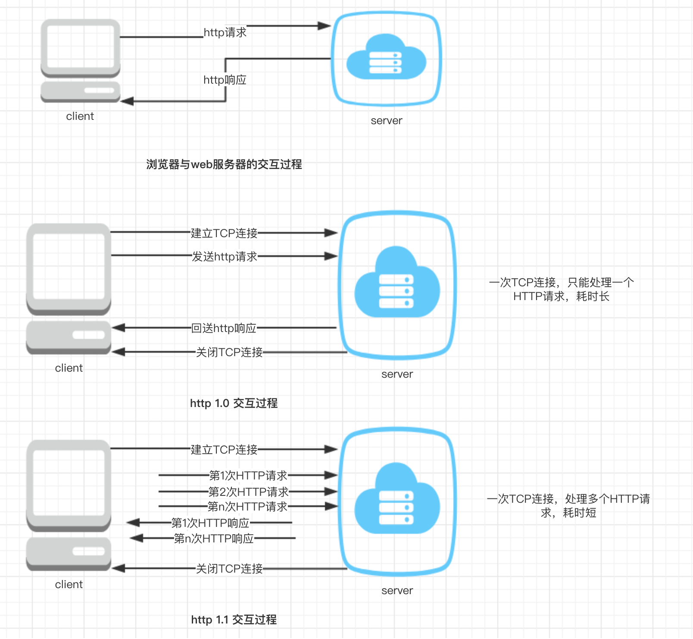

## HTTP 概述



## HTTP 消息

> http 消息是指浏览器与服务器之间传送的具体数据，分为请求和响应，一个完整的消息包含请求行、响应行、消息头、实体内容、消息头保存消息时间、系统环境、内容大小、编码格式等消息。实体内容则保存网页或数据；

1. curl 查看 HTTP 消息

**发送请求并显示响应头消息头**

```sh
# -I, --head Show document info only
> curl -I http://www.baidu.com
HTTP/1.1 200 OK   # http协议版本（http/1.1） 响应状态码 200 OK
Accept-Ranges: bytes
Cache-Control: private, no-cache, no-store, proxy-revalidate, no-transform
Connection: Keep-Alive
Content-Length: 277
Content-Type: text/html
Date: Sat, 30 Mar 2019 14:54:11 GMT # 响应时间
Etag: "575e1f59-115"
Last-Modified: Mon, 13 Jun 2016 02:50:01 GMT
Pragma: no-cache
Server: bfe/1.0.8.1  # 服务器类型
```

**发送请求并显示请求头消息头**

```sh
> curl -v www.baidu.com
* Rebuilt URL to: www.baidu.com/
*   Trying 61.135.169.121...
* TCP_NODELAY set
* Connected to www.baidu.com (61.135.169.121) port 80 (#0)
> GET / HTTP/1.1 # 请求行 请求方式GET 请求资源路径 / http版本 1.1
> Host: www.baidu.com  # 之后为请求头
> User-Agent: curl/7.54.0 # 客户端的系统信息，报货使用的操作系统，版本号等
> Accept: */* # 客户端支持的数据类型
> # 返回内容
< HTTP/1.1 200 OK
< Accept-Ranges: bytes
< Cache-Control: private, no-cache, no-store, proxy-revalidate, no-transform
< Connection: Keep-Alive
< Content-Length: 2381
< Content-Type: text/html
< Date: Sat, 30 Mar 2019 15:02:59 GMT
< Etag: "588604c4-94d"
< Last-Modified: Mon, 23 Jan 2017 13:27:32 GMT
< Pragma: no-cache
< Server: bfe/1.0.8.18
< Set-Cookie: BDORZ=27315; max-age=86400; domain=.baidu.com; path=/
```

**常见响应状态码**

| 状态码           | 含义                                                                                                                                                        |
| ---------------- | ----------------------------------------------------------------------------------------------------------------------------------------------------------- |
| 200(正常)        | 客户端请求成功，响应消息返回正常的请求结果                                                                                                                  |
| 301(永久移动)    | 被请求的文档已经被移动到别处，此文档的新UTL地址为响应头Location的值，浏览器以后对改文档的访问会自动使用新地址                                               |
| 302              | 和301类似，但是Location返回的是一个临时的，非永久的url地址                                                                                                  |
| 304 （命中缓存） | 浏览器在请求时会通过一些请求头描述该文档的缓存情况，当服务器判断文档没有修改时，就用过304告知浏览器继续使用缓存,否则服务器将使用200状态码返回修改后的新文档 |
| 401（未经授权）  | 当浏览器试图访问一个受密码保护的页面时，且在请求头中没有Authorization传递用户信息时，就会返回401状态码要求浏览器重新发送带有Authorization头的信息           |
| 403 (禁止)       | 服务器理解客户端的请求，但是拒绝处理，通常由服务器上传文件或目录的权限设置导致                                                                              |