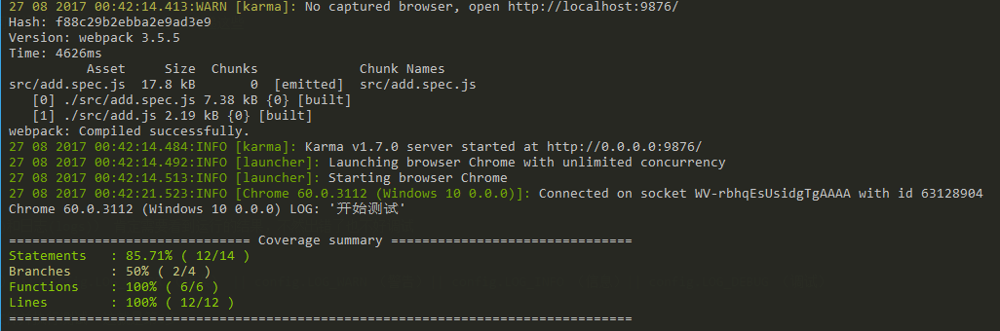

# 前言

一直用别人配置好的东西，经常看别人写教程来写简单的单元测试，闲来无事自己也来撸个配置玩玩。说干就干，从开始到运行成功差不多 5 个小时。遇到各种问题，主要是各种模块的配置版本问题。

# 简单介绍一下要用到东西是什么

## Karma 的介绍

Karma 是 Testacular 的新名字，在 2012 年 google 开源了 Testacular，2013 年 Testacular 改名为 Karma。Karma 是一个让人感到非常神秘的名字，表示佛教中的缘分，因果报应，比 Cassandra 这种名字更让人猜不透！

Karma 是一个基于 Node.js 的 JavaScript 测试执行过程管理工具（Test Runner）。该工具可用于测试所有主流 Web 浏览器，也可集成到 CI（Continuous integration）工具，也可和其他代码编辑器一起使用。这个测试工具的一个强大特性就是，它可以监控(Watch)文件的变化，然后自行执行，通过 console.log 显示测试结果。

## Jasmine 的介绍

Jasmine 是单元测试框架，我将用 Karma 让 Jasmine 测试自动化完成。jasmine 提出行为驱动【BDD(Behavior Driven Development)】,测试先行理念，[Jasmine 的官网](https://jasmine.github.io/1.3/introduction.html)

## istanbul 的介绍

istanbul 是一个单元测试代码覆盖率检查工具，可以很直观地告诉我们，单元测试对代码的控制程度。（ps：这个玩意浪费我好久时间，后面详细说怎么配置）

## webpack 的介绍

webpack 是一个现代 JavaScript 应用程序的模块打包器(module bundler)。当 webpack 处理应用程序时，它会递归地构建一个依赖关系图(dependency graph)，其中包含应用程序需要的每个模块，然后将所有这些模块打包成少量的 bundle - 通常只有一个，由浏览器加载。[查看 webpack](https://webpack.docschina.org/concepts)

# 构建 Test 工程，开始新生上路

1. 创建一个文件 test-demo
2. 进入 test-demo，在当前文件夹里打开命令行，输入 npm init -y;
   
3. 自动生成 package.json 文件。
   

## 安装相关依赖

### 安装 Karma

```sh
npm install karma -g
```

并且还有安装项目中使用

```sh
npm install karma  --save-dev
```

需要全局安装，可以使用命令行。

安装完成以后，命令行输入 karma start


在浏览器输入http://localhost:9876/


如果出现以上信息，表示 karma 已经安装成功。

### Karma 配置

初始化 karma 配置文件 karma.conf.js

> ctrl+c 结束刚才启动的 Karma

在命令行输入 karma init


接下就是一段询问关于配置的问题。（ps：karma.conf.js 配置可以自己修改，这里是快速生成配置）

Which testing framework do you want to use ?（你想要使用哪个测试框架？）
默认是 jasmine。（如果你想用其他可以自己修改），直接回车下一步

Do you want to use Require.js ? （你要使用 Require.js 吗？）
This will add Require.js plugin. （这将添加 Require.js 插件。）
Press tab to list possible options. Enter to move to the next question. （按选项卡列出可能的选项。 输入转到下一个问题。）
默认是 no。（现在都在使用 webpack 打包，这也是为什么你肯定奇怪的地方，单元测试为什么要用 webpack） ，直接回车下一步

Do you want to capture any browsers automatically ? （你想要在哪些浏览器里面运行）
Press tab to list possible options. Enter empty string to move to the next question.（和上面一样）
默认是 Chrome。（你可以添加更多浏览器回车就是填写下一个浏览器名称，必须是你电脑安装的浏览器，最好还是去 karma.conf.js 添加直观一些），直接按 2 次回车下一步

What is the location of your source and test files ?（测试文件的位置是什么？）
You can use glob patterns, eg. `"js/*.js" or "test/**/*Spec.js"`.（你可以使用 glob 模式，例如。 “js / _.js”或“test / \*\* / _ Spec.js”）
Enter empty string to move to the next question.（输入空字符串移动到下一个问题。）
默认是空，这个是配置你的单元测试用例的文件，根据自己项目和喜好，你可以把测试用例文件和当前被文件放在一起，例如 angular-cli 就是这样的。也可以单独分离放到 test 文件下，github 大量的 npm 包都是这样的。我这里就学 angular-cli 做法，填写：`src/\*_/_.spec.js`，就是说 scr 文件夹下的所有.spec.js 后缀都是 t 测试用例文件。回车下一步


你写了这样一定会跟我报错，


需要去如图新建随意.spec.js 后缀文件，

如果不想建，可以直接下一步，等会到 karma.conf.js 修改。

Should any of the files included by the previous patterns be excluded ?（是否应排除某些包含的任何文件？）
You can use glob patterns, eg. "/_.swp". （您可以使用 glob 模式，例如。“/_.SWP”。）
这是为了性能优化，排除那些文件不需要去监听，加快运行速度。如果你不确定要排除哪些文件，可以去 karma.conf.js 修改。我就直接直接下一步了。

Do you want Karma to watch all the files and run the tests on change ? （你想要 Karma 来监听所有的文件，并在变化中运行测试吗？）
Press tab to list possible options. （按选项卡列出可能的选项。）
默认 yes，它的意思你写完了.spec.js 后缀文件会自动运行测试，等我们把 Karma 跑起来，在自动运行。
这里 no。


这就生成出来了配置
找一款你顺手的编辑器打开它，（我的用 vscode）


一大堆看不懂的东西，我给它们一一注释一下；


接下来就说关于依赖插件 plugins

- 需要可以打开 Chrome 浏览器的插件 npm install karma-chrome-launcher --save-dev
- 需要可以运行 jasmine 的插件 npm install karma-jasmine --save-dev
- 需要可以运行 webpack 的插件 npm install karma-webpack --save-dev
- 需要可以显示 sourcemap 的插件 npm install karma-sourcemap-loader --save-dev
- 需要可以显示测试代码覆盖率的插件 npm install karma-coverage-istanbul-reporter --save-dev
- 插件就先安装这么多，后面需要在安装，可以这样一起安装：

```sh
npm install karma-chrome-launcher karma-jasmine karma-webpack karma-sourcemap-loader karma-coverage-istanbul-reporter  --save-dev
```

把插件写到配置里面去


我们先只需要前 2 个，后面注释起来，让 karma 能随时跑起来。


然后去 package.json 配置一个 npm 命令，编辑器或者 ide 可以直接运行 npm 命令。

我们 karma 可以运行起来，karma 配置先就到这里。

## 安装 Jasmine

并且还有安装项目中使用

npm install jasmine-core --save-dev
在安装的过程我们可以去看看 jasmine 文档

jasmine 5 个核心

1. describe 块称为"测试套件"（test suite），表示一组相关的测试。它是一个函数，第一个参数是测试套件的名称（"index.js 的测试"），第二个参数是一个实际执行的函数。

2. it 块称为"测试用例"（test case），表示一个单独的测试，是测试的最小单位。它也是一个函数，第一个参数是测试用例的名称（"1 应该是数字"），第二个参数是一个实际执行的函数。

3. expect 是解析一段代码，返回解析后的值。

4. 匹配器，jasmine 内置了很多匹配器，例如：toBe 、not.toBe 等，也可以自定义匹配器。

5. 钩子函数，为了减少重复性的代码，jasmine 提供了 beforeEach、afterEach、beforeAll、afterAll 方法。

- beforeEach() :在 describe 函数中每个 Spec 执行之前执行；
- afterEach() :在 describe 函数中每个 Spec 执行之后执行;
- beforeAll() :在 describe 函数中所有的 Specs 执行之前执行，且只执行一次
- afterAll () : 在 describe 函数中所有的 Specs 执行之后执行，且只执行一次

看了文档我们去写一个简单测试用例。


这个例子非常简单，1+1===2;


因为我们的测试示例写的是对的，所以没有任何错误提示。

怎么看运行结果，karma 会自动打开一个谷歌浏览器


点击后一片空白


打开控制台（F12）


可以看到输出结果。非常 ok

接下来我们加一个 1+1===3，这个按正常来说是错的，


你会发现没有任何提示，因为我们没有安装一些东西，后面来说。现在只能去看 karma 打开的谷歌浏览器的控制台了。


有一个错误提示，说预期 2，和匹配结果 3 不对应。ok 没毛病。

简陋版测试已经跑起来了，接下来我们要写自己代码 add 相加函数。

## 安装 Webpack

```sh
npm install webpack webpack-cli --save-dev
```

安装需要时间，这个我们去写个简单的例子，一个简单的 add 函数。


这里用的 es6，模块导出，浏览器还不认识，需要用到 babel 转换。

- babel 核心文件 npm install babel-core --save-dev
- webpack 的 Loader 处理器 npm install babel-loader --save-dev
- babel 的 istanbul 覆盖率插件 npm install babel-plugin-istanbul --save-dev
- babel 转换到哪个版本这里是 ES2015 npm install babel-preset-es2015 --save-dev
  插件就先安装这么多，后面需要在安装，可以这样一起安装：

```sh
npm install babel-core babel-loader install babel-plugin-istanbul babel-loader babel-preset-es2015  --save-dev
```

这时候我们代码还是那样，需要去配置 karma.conf.js，


webpack 配置就不多做介绍，这里不是 webpack 教程，也不是一两句可以说完，看教程。

因为这里配置比较简单，就直接放在里面。如果复杂就需要单独抽出去做一个配置文件。

> ps：它和我们一般项目的配置是有点区别的，webpack 有四个核心概念：入口(entry)、输出(output)、loader、插件(plugins)。这里不需要入口(entry)和输出(output)配置。这点需要注意。

还需要打开注释的插件


运行一下 npm run unit， 没错误继续。一步一个脚印，不要到最后全是错误，放弃了。边写边测试。

### 测试 add 函数

1. add.spec.js 引入 add.js

```js
import add from './add';
```

2. 新增一个测试套件


3. 运行 npm run unit
   

4. karma 打开的浏览器查看
   

出问题了，现在浏览器都还不识别 import。我们需要用 babel 转换成 ES5 显示。


我们需要配置 preprocessors
我们在运行，打开控制台查看：


完美运行

接着继续，我们还需要生成源文件映射的 map 文件，
修改配置：


> 注意：每次修改完 karma.conf.js 都需要重新运行 npm run unit。运行没有问题，我们接着继续最后一个话题 istanbul 代码覆盖率显示。

## 安装 Istanbul

还需要安装 Istanbul 相关的依赖

- webpack 的 Loader 处理器 npm install istanbul-instrumenter-loader --save-dev
- 测试覆盖率显示插件 npm install karma-coverage-istanbul-reporter --save-dev

我们先安装他们，然后去修改 karma.conf.js


先给 babel 加上插件 plugins: ['istanbul']


在写上 istanbul-instrumenter-loader 的配置。


添加完成以后，重新运行 npm run unit。没问题继续。


我们使用 coverage-istanbul 显示测试结果


打开所有插件注释。


覆盖率显示配置，看注释说明


> 注意：一定要打开自动监听才有覆盖率显示，

运行以后，就会生成


命令行显示


文件夹里面显示

### 怎么测覆盖率（code coverage）

它有四个测量维度。

- 行覆盖率（line coverage）：是否每一行都执行了？
- 函数覆盖率（function coverage）：是否每个函数都调用了？
- 分支覆盖率（branch coverage）：是否每个 if 代码块都执行了？
- 语句覆盖率（statement coverage）：是否每个语句都执行了？

```js
export default function add(num1, num2) {
  return num1 + num2;
}
```

我们将这个函数变得复杂点，如果不写 num2，就默认是 0。

```js
export default function add(num1, num2) {
  if (num2 === undefined) num2 = 0;
  return num1 + num2;
}
```


命令行显示结果


浏览器打开 coverage/html/index.html

> 注意：命令行显示合计测试覆盖率，详细需在浏览器看。

测试结果分析：
1 个语句覆盖率（statement coverage）没有覆盖到，1 个分支覆盖率（branch coverage）没有覆盖到，1 个函数覆盖率（function coverage）已经调用，3 行行覆盖率（line coverage）全部覆盖

我们再来个复杂的栗子：

```js
export default function add(num1, num2) {
  if (num1 === undefined) num1 = 0;
  if (num2 === undefined) num2 = 0;
  return num1 + num2;
}
```


命令行显示结果


浏览器打开 coverage/html/index.html

测试结果分析：
2 个语句覆盖率（statement coverage）没有覆盖到，2 个分支覆盖率（branch coverage）没有覆盖到，1 个函数覆盖率（function coverage）已经调用，3 行行覆盖率（line coverage）全部覆盖


增加测试用例

全部覆盖，ok 完工。[demo](https://github.com/liuxsen/karma)
