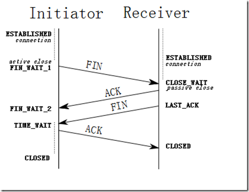
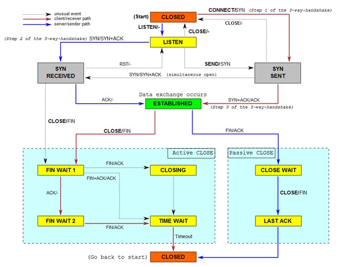

## 为什么需要“三次握手”

在谢希仁著《计算机网络》第四版中讲“三次握手”的目的是“为了防止已失效的连接请求报文段突然又传送到了服务端，因而产生错误”。在另一部经典的《计算机网络》一书中讲“三次握手”的目的是为了解决“网络中存在延迟的重复分组”的问题。这两种不用的表述其实阐明的是同一个问题。

> 希仁版《计算机网络》中的例子是这样的，“已失效的连接请求报文段”的产生在这样一种情况下：client 发出的第一个连接请求报文段并没有丢失，而是在某个网络结点长时间的滞留了，以致延误到连接释放以后的某个时间才到达 server。本来这是一个早已失效的报文段。但 server 收到此失效的连接请求报文段后，就误认为是 client 再次发出的一个新的连接请求。于是就向 client 发出确认报文段，同意建立连接。假设不采用“三次握手”，那么只要 server 发出确认，新的连接就建立了。由于现在 client 并没有发出建立连接的请求，因此不会理睬 server 的确认，也不会向 server 发送数据。但 server 却以为新的运输连接已经建立，并一直等待 client 发来数据。这样，server 的很多资源就白白浪费掉了。采用“三次握手”的办法可以防止上述现象发生。例如刚才那种情况，client 不会向 server 的确认发出确认。server 由于收不到确认，就知道 client 并没有要求建立连接。”。主要目的防止 server 端一直等待，浪费资源。

为什么需要“四次挥手”
    那可能有人会有疑问，在 tcp 连接握手时为何 ACK 是和 SYN 一起发送，这里 ACK 却没有和 FIN 一起发送呢。原因是因为 tcp 是全双工模式，接收到 FIN 时意味将没有数据再发来，但是还是可以继续发送数据。

3 次握手过程状态：
LISTEN: 这个也是非常容易理解的一个状态，表示服务器端的某个 SOCKET 处于监听状态，可以接受连接了。
SYN_SENT: 当客户端 SOCKET 执行 CONNECT 连接时，它首先发送 SYN 报文，因此也随即它会进入到了 SYN_SENT 状态，并等待服务端的发送三次握手中的第 2 个报文。SYN_SENT 状态表示客户端已发送 SYN 报文。（发送端）

SYN_RCVD: 这个状态与 SYN_SENT 遥想呼应这个状态表示接受到了 SYN 报文，在正常情况下，这个状态是服务器端的 SOCKET 在建立 TCP 连接时的三次握手会话过程中的一个中间状态，很短暂，基本上用 netstat 你是很难看到这种状态的，除非你特意写了一个客户端测试程序，故意将三次 TCP 握手过程中最后一个 ACK 报文不予发送。因此这种状态时，当收到客户端的 ACK 报文后，它会进入到 ESTABLISHED 状态。（服务器端）
ESTABLISHED：这个容易理解了，表示连接已经建立了。

4 次挥手过程状态：（可参考下图）

FIN_WAIT_1: 这个状态要好好解释一下，其实 FIN_WAIT_1 和 FIN_WAIT_2 状态的真正含义都是表示等待对方的 FIN 报文。而这两种状态的区别是：FIN_WAIT_1 状态实际上是当 SOCKET 在 ESTABLISHED 状态时，它想主动关闭连接，向对方发送了 FIN 报文，此时该 SOCKET 即进入到 FIN_WAIT_1 状态。而当对方回应 ACK 报文后，则进入到 FIN_WAIT_2 状态，当然在实际的正常情况下，无论对方何种情况下，都应该马上回应 ACK 报文，所以 FIN_WAIT_1 状态一般是比较难见到的，而 FIN_WAIT_2 状态还有时常常可以用 netstat 看到。（主动方）
FIN_WAIT_2：上面已经详细解释了这种状态，实际上 FIN_WAIT_2 状态下的 SOCKET，表示半连接，也即有一方要求 close 连接，但另外还告诉对方，我暂时还有点数据需要传送给你(ACK 信息)，稍后再关闭连接。（主动方）
TIME_WAIT: 表示收到了对方的 FIN 报文，并发送出了 ACK 报文，就等 2MSL 后即可回到 CLOSED 可用状态了。如果 FIN_WAIT_1 状态下，收到了对方同时带 FIN 标志和 ACK 标志的报文时，可以直接进入到 TIME_WAIT 状态，而无须经过 FIN_WAIT_2 状态。（主动方）
CLOSING（比较少见）: 这种状态比较特殊，实际情况中应该是很少见，属于一种比较罕见的例外状态。正常情况下，当你发送 FIN 报文后，按理来说是应该先收到（或同时收到）对方的 ACK 报文，再收到对方的 FIN 报文。但是 CLOSING 状态表示你发送 FIN 报文后，并没有收到对方的 ACK 报文，反而却也收到了对方的 FIN 报文。什么情况下会出现此种情况呢？其实细想一下，也不难得出结论：那就是如果双方几乎在同时 close 一个 SOCKET 的话，那么就出现了双方同时发送 FIN 报文的情况，也即会出现 CLOSING 状态，表示双方都正在关闭 SOCKET 连接。
CLOSE_WAIT: 这种状态的含义其实是表示在等待关闭。怎么理解呢？当对方 close 一个 SOCKET 后发送 FIN 报文给自己，你系统毫无疑问地会回应一个 ACK 报文给对方，此时则进入到 CLOSE_WAIT 状态。接下来呢，实际上你真正需要考虑的事情是察看你是否还有数据发送给对方，如果没有的话，那么你也就可以 close 这个 SOCKET，发送 FIN 报文给对方，也即关闭连接。所以你在 CLOSE_WAIT 状态下，需要完成的事情是等待你去关闭连接。（被动方）
LAST_ACK: 这个状态还是比较容易好理解的，它是被动关闭一方在发送 FIN 报文后，最后等待对方的 ACK 报文。当收到 ACK 报文后，也即可以进入到 CLOSED 可用状态了。（被动方）

CLOSED: 表示连接中断。

TCP 的具体状态图可参考：

