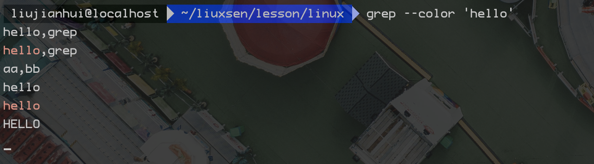
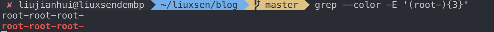

1. grep 命令

> 标准输入方式,标准输入就是指通过键盘输入待匹配的内容，如下

```sh
grep --color 'hello'
```



> 管道输入方式 管道的符号是 |，管道是 linux 中支持的一种通信机制，作用是将一个程序的输出作为另一个程序的输入

```sh
ifconfig | grep --color 192
```


> 文件方式,grep 命令的第二个参数是可选参数，用于读取指定的文件内容尽心正则模式匹配，以读取指定文件

```sh
grep --color ''
```


2. 元字符、文本字符和转义字符

> 一个完整的正则表达式由元字符和文本字符串两部分构成，其中元字符就是具有特殊含义的字符，如`^` `$` `.` `*` ， 文本字符就是普通的文本，如字母和数字等，若要匹配的内容是元字符本身时，就需要在前面加上转义字符 `\` 如 `\^`; `\` 本身也属于元字符，用`\\` 转义

eg:

```sh
grep --color '[\^\*\&\\]'
```


3. 分组

> 正则表达式，支持分组(又成为子模式，子匹配)，用小括号`()`实现,括号用于嵌套一个子模式，

```sh
grep --color -E '(root-){3}'
```



## 正则表达式语法规则

1. 定位符

| 定位符 | 说明                 | 示例   | 匹配结果     |
| ------ | -------------------- | ------ | ------------ |
| ^      | 匹配字符串开始的位置 | ^Hello | `Hello`world |
| $      | 匹配字符串结束的位置 | world$ | Hello`world` |

  *注* grep 命令进行匹配时，只能按行一次匹配，不能实现跨换行符的多行匹配，当需要匹配空行是，用`^$`;

2. 选择符

> `|` 或
```sh
grep --color -E 'Linux|Nnix'
```

> 字符串范围，当需要匹配某个范围内的字符时，可以用中括号 `[]` 和 连字符 `-` 实现，在中括号中的 `^` 表示匹配不在指定字符范围内的字符

 | 说明                      | 示例   | 匹配结果 |
 | ------------------------- | ------ | -------- |
 | 匹配字符 a、b、c、        | [abc]  | `abc`d   |
 | 匹配除a、b、c、以外的字符 | [^abc] | abc`d`   |
 | 匹配字符a~z范围内的字符   | [a~z]  | `abcd`   |

> 点字符和限定符； 点字符 `.` 用于匹配一个任意字符，限定符 (`?`、`+` `*` `{}`) 用于匹配某个字符联系出现的次数；


| 字符  | 说明                           | 示例      | 结果                            |
| ----- | ------------------------------ | --------- | ------------------------------- |
| .     | 匹配一个任意字符               | s.t       | 可匹配 `sat` `sgt` `srt` 等     |
| ?     | 匹配前面的字符零次或一次       | colou?r   | 可匹配 colour colr              |
| +     | 匹配前面的字符一次或者多次     | go+gle    | 可匹配范围从 gogle 到 gooo**gle |
| *     | 匹配前面的字符零次或者多次     | go*gle    | 可匹配 ggle 到`go***gle`        |
| {n}   | 匹配前面的字符多次             | go{2}gle  | 可匹配 google                   |
| {n,}  | 匹配前面的字符最少n次          | go{2,}gle | 可匹配 google 到 goooo***gle    |
| {n,m} | 匹配前面的字符最少n次，最多m次 | g{1,2}    | 可匹配 g 到 gg                  |

> 正则表达式支持贪婪匹配和惰性匹配两种，贪婪标识匹配尽可能多的字符，惰性匹配尽可能少的字符，默认是贪婪匹配；惰性匹配在上一个限定符后面加上 `?`

| 匹配方式 | 示例  | 说明                     | 匹配结果       |
| -------- | ----- | ------------------------ | -------------- |
| 贪婪     | a.*b  | 最先出现的a到最后的b     | `a123b123b`123 |
| 懒惰     | a.*?b | 最先出现的a到最先出现的b | `a123b`123b123 |

> 小括号；一个是改变作用范围，一个是分组

改变作用范围

| 示例            | 说明           | 匹配结果         |
| --------------- | -------------- | ---------------- |
| `thir|fourth`   | 改变作用范围前 | `thir`th`fourth` |
| `(thir|four)`th | 改变作用范围后 | `thirthfourth`   |

分组
| 示例     | 说明   | 匹配结果           |
| -------- | ------ | ------------------ |
| app{2}   | 分组前 | `apppp`ppaaapppp   |
| (app){2} | 分组后 | `app`ppppaa`app`pp |

> 反斜线 `/` 两个作用，一个是转义字符，二是标识一些不可大意的字符、指定预定义的字符集

反斜线的常用功能

| 字符 | 说明                                 |
| ---- | ------------------------------------ |
| \d   | 任意一个十进制数字 相当于 [0-9]      |
| \D   | 任意一个非十进制数字                 |
| \w   | 任意一个单词字符 相当于 [a-zA-Z0-9]  |
| \W   | 任意一个非单词字符                   |
| \s   | 任意一个空白字符（空格、水表制表符） |
| \S   | 任意一个非空白字符                   |
| \b   | 单词分界符，                         |
| \b   | 单词分界符，                         |
