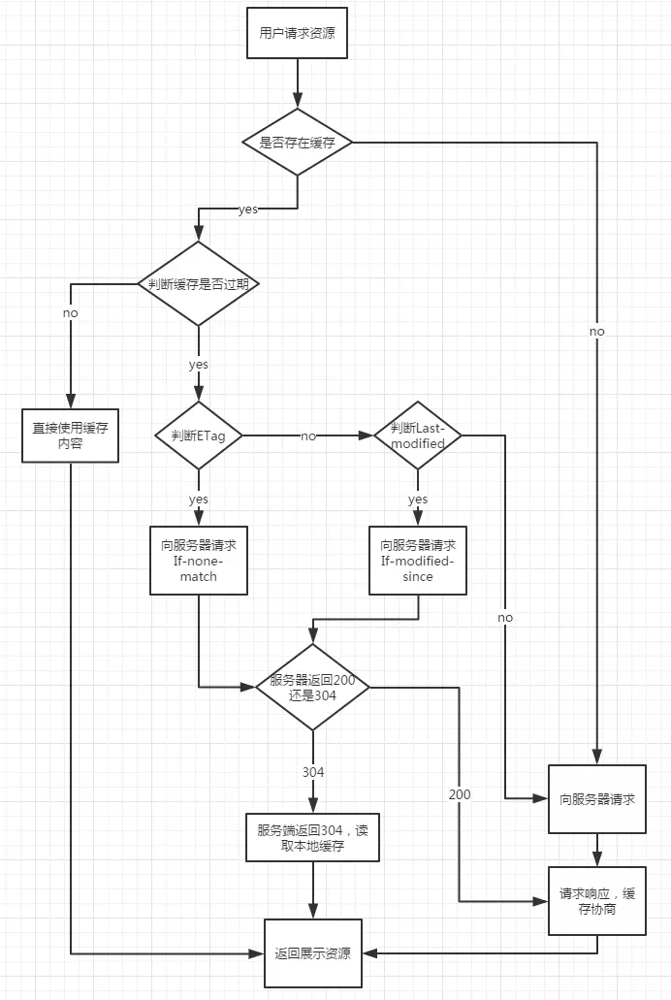
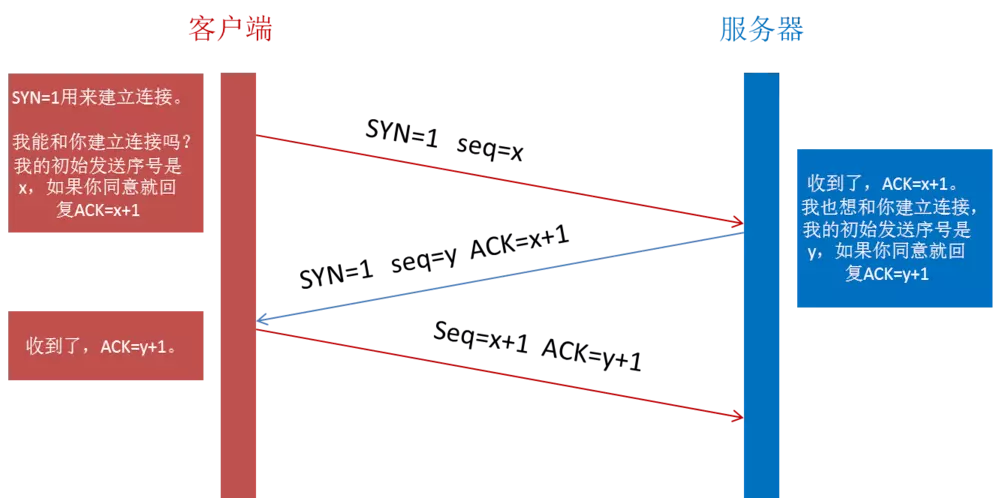
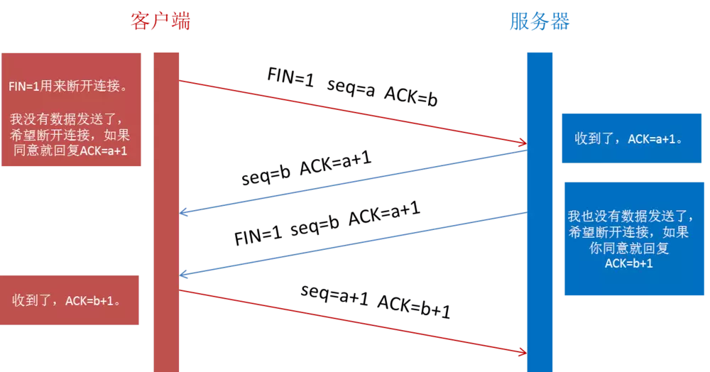

> 这是一个很经典的面试题

1. 浏览器接收 URL
   > URL 包含的信息：协议、网络地址:端口号、资源路径、查询字符串？、片段标识符#
2. 将 URL 与缓存进行比对如果请求的页面在缓存中且未过期，则直接进行第 8 步
   2.1 缓存分为彻底缓存和缓存协商，这里的确认是否过期是指彻底缓存（缓存失效之前不再需要跟服务器交互）。

> 彻底缓存的机制（http 首部字段）：cache-control，Expires--Expires 是一个绝对时间，即服务器时间。浏览器检查当前时间，如果还没到失效时间就直接使用缓存文件。但是该方法存在一个问题：服务器时间与客户端时间可能不一致。因此该字段已经很少使用，现在基本用 cache-control 进行判断。--cache-control 中的 max-age 保存一个相对时间。例如 Cache-Control: max-age = 484200，表示浏览器收到文件后，缓存在 484200s 内均有效。 如果同时存在 cache-control 和 Expires，浏览器总是优先使用 cache-control。

cache-control 还有其他指令：

- （请求/响应指令）
  - no-cache,使用缓存前必须和服务器进行确认，也就是需要发起请求。
  - no-store,不缓存；

-（响应指令）

- public，缓存文件保存在缓存服务器上，且其他用户也可以访问；
- private，只有特定用户才能访问该缓存资源。

> 当缓存过期时，浏览器会向服务器发起请求询问资源是否真正过期，这就是缓存协商。
> 对应 http 首部字段：**last-modified，Etag--last-modified** 是第一次请求资源时，服务器返回的字段，表示最后一次更新的时间。下一次浏览器请求资源时就发送 **if-modified-since** 字段。服务器用本地 **Last-modified** 时间与 **if-modified-since** 时间比较，如果不一致则认为缓存已过期并返回新资源给浏览器；如果时间一致则发送 304 状态码，让浏览器继续使用缓存。当然，用该方法也存在问题，比如修改时间有变化但实际内容没有变化，而服务器却再次将资源发送给浏览器。所以，使用 Etag 进行判断更好。--Etag：资源的实体标识（哈希字符串），当资源内容更新时，Etag 会改变。服务器会判断 Etag 是否发生变化，如果变化则返回新资源，否则返回 304。
> 缓存协商的过程需要发起一起 HTTP 请求，如果返回 304 则继续使用缓存。对于移动端一次请求还是有代价的，所以我们需要避免 304。
> 对于很少进行更改的静态文件，可以在文件名中加入版本号，如 get.v1.js，并且把 Cache-Control 的 max-age 设置成一年半载，这样就不会发送请求。
> 需要注意的是，当这些文件更新的时候，我们需要更新其版本号，这样浏览器才会到服务器下载新资源。

2.3 贴一个缓存机制的图（来自浅谈 Web 缓存）

> 

2.4 除了 http 首部设置缓存，HTML5 的 manifest 文件也可以设置缓存。但现在已经被标准舍弃，也就没有讨论的必要。

如果网络地址不是一个 IP 地址，通过 DNS 解析域名返回一个 IP 地址 3.1 DNS 协议：DNS 数据库是域名和 IP 地址相互映射的一个分布式数据库，DNS 协议用来将域名转换为 IP 地址，它运行在 UDP 协议之上。为什么选择 UDP 而非 TCP？原因如下：UDP 无需连接，时效性更好，进行一次查询只需要两个 DNS 包。而 TCP 需要先用 3 个包建立连接，再用 2 个 DNS 包进行查询，最后用 4 个包断开连接，连接成本远大于查询本身，容易让 DNS 服务器不堪重负。3.2 DNS 查询：操作系统会先检查本地 hosts 文件是否有这个网址映射关系，如果有就调用这个 IP 地址映射，完成域名解析。否则，查找本地 DNS 解析器缓存，如果查找到则返回。否则，查找本地 DNS 服务器，如果查找到则返回。否则，1）未用转发模式，按根域服务器 ->顶级域,.com->第二层域，example.com ->子域，www.example.com 的顺序找到 IP 地址。2）用转发模式，按上一级 DNS 服务器->上上级->....逐级向上查询找到 IP 地址。4.浏览器与服务器通过三次握手(SYN,SYN/ACK,ACK)建立 TCP 连接

**为什么需要进行三次握手，而不是两次握手？**

原因是两次握手不可靠。比如，浏览器发送一个连接请求包 A，但包 A 在半路上堵车了，浏览器就认为包 A 丢失了，所以重新发生一个请求包 B 给服务器。服务器收到请求，建立连接。两端进行通信，结束后关闭连接。但是这时候，包 A 到达了服务器，服务器不知道这是一个无效的包，所以进行响应。这时两次握手已经完成，两端就建立起一个无效的连接。但浏览器认为自己没发出请求，所以不会回应，这样就让服务器白白等待回应，浪费了服务器资源。而三次握手的机制下，浏览器知道自己并没有请求连接，会发送拒绝包给服务器，服务器收到回应后也会结束这次无效的连接。

5. 浏览器向服务器发送 HTTP 请求。
   数据经过应用层、传输层、网络层、物理层逐层封装，传输到下一个目的地。

其中，每一层的作用如下。

应用层：为应用进程提供服务，加应用层首部封装为协议数据单元。
传输层：实现端到端通信，加 TCP 首部封装为数据包，TCP 控制了数据包的发送序列的产生，不断的调整发送序列，实现流控和数据完整。
网络层：转发分组并选择路由；加 IP 首部封装为 IP 分组。
数据链路层：相邻的节点间的数据传输；加首部[mac 地址]和尾部封装为帧。
物理层：具体物理媒介中的数据传送，数据转换为比特流。

下一个目的地接受到数据后，从物理层得到数据然后经过逐层的解包 到 链路层 到 网络层，然后开始上述的处理，在经网络层 链路层 物理层将数据封装好继续传往下一个地址。到达最终目的地，再经过 5 层结构，逐层剥离，最终将数据送到目的主机的目的端口。

6. 服务器收到请求，从它的文档空间中查找资源并返回 HTTP 响应。

7. 浏览器接受 HTTP 响应，检查 HTTP header 里的状态码，并做出不同的处理方式。比如 404 显示错误页面，304 使用缓存，200 下一步解码和渲染， 204 页面不会发生更新。
   1. 常见状态码：
   - 200 ok,
   - 204 no content,
   - 206 partial content
   - 301 moved permanently(资源已分配新的 uri)，
   - 302 found(本次使用新 uri 访问)，
   - 303 see other(以 get 定向到另一个 uri)，
   - 304 not modified, 307 temporary redirect(不会从 post 改为 get)400 bad request，402 unauthorized，403 forbidden,
   - 404 not found
   - 500 internal server error，
   - 503 service unavailable
8. 如果是可以缓存的，这个响应则会被存储起来。

根据首部字段判断是否进行缓存。例如，Cache-Control, no-cache(每次使用缓存前和服务器确认)，no-store 绝对禁止缓存

9. 解码
   9.1 浏览器拿到 index.html 文件后，就开始解析其中的 html 代码，遇到 js/css/image 等静态资源时，就向服务器端去请求下载 9.2 解析成对应的树形数据结构 DOM 树、CSS 规则树，Javascript 脚本通过 DOM API 和 CSSOM API 来操作 DOM 树、CSS 规则树。

10. 渲染
    10.1 计算 CSS 样式（JS 可动态修改 dom 或 css,进一步改变渲染树和分布）
    10.2 构建渲染树（Repaint：屏幕的一部分要重画，比如某个 CSS 的背景色变了，元素的几何尺寸没有变。Reflow：几何尺寸变了，我们需要重新验证并计算 Render Tree。）
    10.3 确认布局（定位坐标和大小，是否换行，各种 position, overflow, z-index 属性 ……）
    10.4 绘制（调用操作系统 Native GUI 的 API 绘制，将每个节点转化为实际像素绘制到视口上）

11. 关闭 TCP 连接或继续保持连接
    通过四次挥手关闭连接(FIN ACK, ACK, FIN ACK, ACK)。
    

为什么需要进行四次挥手？

第一次挥手是浏览器发完数据后，发送 FIN 请求断开连接。第二次挥手是服务器发送 ACK 表示同意，如果在这一次服务器也发送 FIN 请求断开连接似乎也没有不妥，但考虑到服务器可能还有数据要发送，所以服务器发送 FIN 应该放在第三次挥手中。这样浏览器需要返回 ACK 表示同意，也就是第四次挥手。简而言之，一端断开连接需要两次挥手（请求和回应），两端断开连接就需要四次挥手了。
