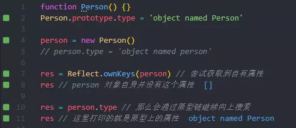

## 图解原型和原型链

原型和原型链是 JS 中不可避免需要碰到的知识点 📕，本文使用图片思维导图的形式缕一缕原型、原型链、实例、构造函数等等概念之间的关系 🌚

### Constructor 构造函数

首先我们先写一个构造函数 Person，构造函数一般为了区别普通函数要求首字母大写:

```js
function Person() {}
```

### prototype 原型

原型指的就是一个对象，实例“继承”那个对象的属性。在原型上定义的属性，通过“继承”，实例也拥有了这个属性。“继承”这个行为是在 new 操作符内部实现的。

先不说实例，原型与构造函数的关系就是，构造函数内部有一个名为 prototype 的属性，通过这个属性就能访问到原型：


Person 就是构造函数，Person.prototype 就是原型


### instance 实例

有个构造函数，我们就可以在原型上创建可以“继承”的属性，并通过 new 操作符创建实例


比方说 Person，我们要创建一个 person 实例，那么使用 new 操作符就可以实现，并通过 instanceof 来检查他们之间的关系：


我们在原型上定义一个属性，那么实例上也就可以“继承”这个属性：


### proto 隐式原型

实例通过 **proto** 访问到原型，所以如果是实例，那么就可以通过这个属性直接访问到原型：


所以这两者是等价的：


### constructor 构造函数

既然构造函数通过 prototype 来访问到原型，那么原型也应该能够通过某种途径访问到构造函数，这就是 constructor：


因此两者的关系应该是这样：


> 注意这里的 constructor 是原型的一个属性，Constructor 指的才是真正的构造函数。两者名字不要弄混了 😀

## 实例、构造函数、原型之间的关系

这里我们可以看到如果实例想要访问构造函数，那么应当是：


没有从实例直接访问到构造函数的属性或方法：


实例与原型则是通过上文中提到的 **proto** 去访问到。
在读取一个实例的属性的过程中，如果属性在该实例中没有找到，那么就会循着 **proto** 指定的原型上去寻找，如果还找不到，则尝试寻找原型的原型 🐚：



我们把注释删掉，给实例同名属性，可以看到打印出来的属性就指向这个：


原型链
原型同样也可以通过 **proto** 访问到原型的原型，比方说这里有个构造函数 Person 然后“继承”前者的有一个构造函数 People，然后 new People 得到实例 p
当访问 p 中的一个非自有属性的时候，就会通过 **proto** 作为桥梁连接起来的一系列原型、原型的原型、原型的原型的原型直到 Object 构造函数为止。
这个搜索的过程形成的链状关系就是原型链


如下图：


看到 null 了么，原型链搜索搜到 null 为止，搜不到那访问的这个属性就是不存在的：


以上，这就是原型、原型链、构造函数、实例、null 之间的关系。
